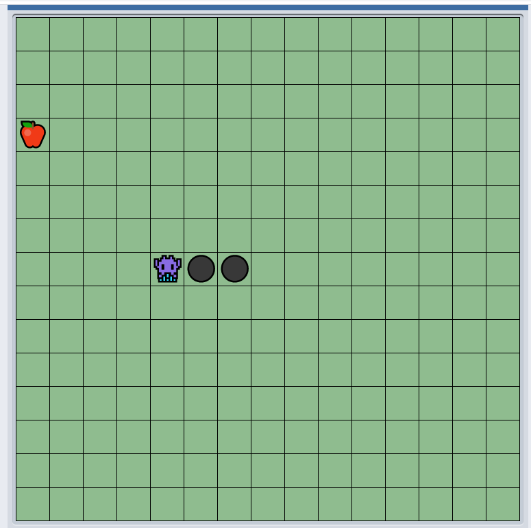

# HungrySnake

Java Implementation of the legendary snake game. Goal of game is to eat as much apples as possible.
Snake grows in length as it eats apples. This games uses codegym's Game class library.
Play my game here: https://codegym.cc/projects/apps/42167
Enjoy!

## Controls
1. Use UP, DOWN, LEFT and RIGHT arrow keys to control snake movement.
2. Use spacebar to restart a game after game over.

## Rules:
1. Game over if snake goes beyond the tile boundary.
2. Game over if snake crosses itself.

## Further Improvements To Make
1. Add other fruits for the snake to eat. Different fruits should have different score weights.
2. Add special point boosters stones.
3. Add bad fruits which makes snake shrink in length

## References
1. https://codegym.cc/projects/games/com.codegym.games.snake